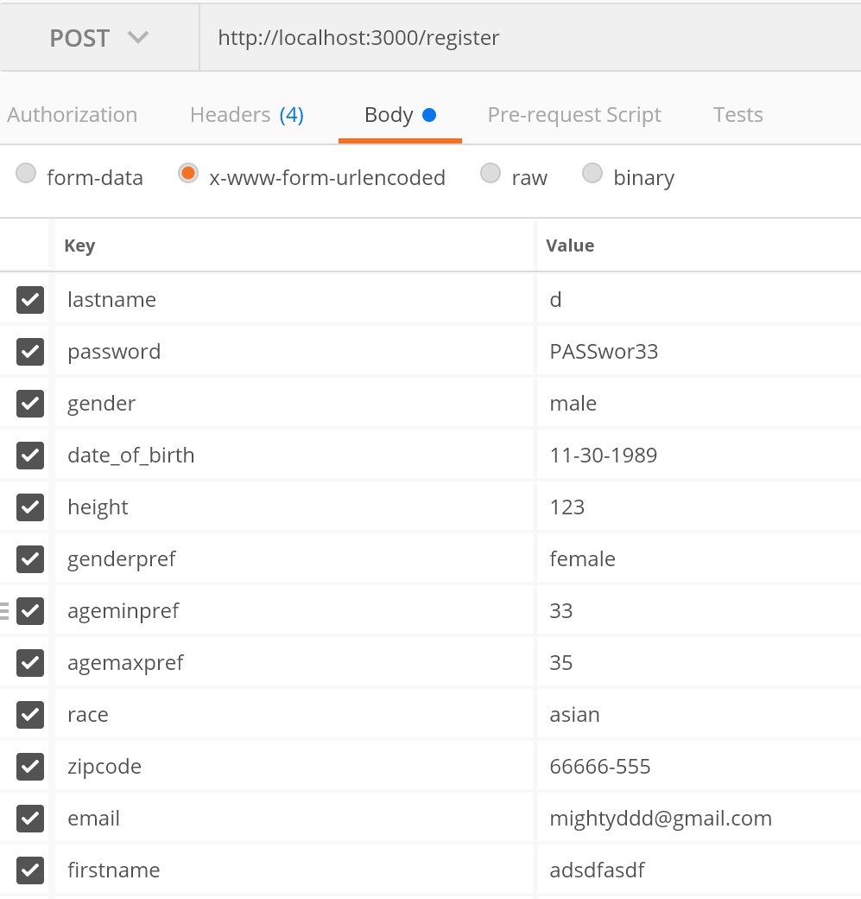

# User Registration NodeJS Project

### Summary

Registration API to handle registration function

#### User Stories:
1. [x] Accept a POST request to path "/register"
2. [x] Expect to receive data of a JSON object containing the following information of a user
- Email,
- First Name
- Last Name
- Password
- Gender
- Date of Birth
- Zipcode
- Height
- Gender Preference
- Age Preference Min
- Age Preference Max
- Race (optional)
- Religion (optional)
3. [x] Securely hash the Password for storage
4. [x] Allow user to upload a profile picture via path "/uploadProfile"
5. [x] Enforce necessary data validation and proper errors should be returned
6. [x] Return a success message if all validations are passed
7. [x] Store information in a local database, preferably, MySQL
Requirements
8. [x] Accept input and return output in JSON

## Getting Started

Clone the git repository:
```
git clone git@github.com:quangthuyhoang/nodejsRegistration.git
```
or 
```
git clone https://github.com/quangthuyhoang/nodejsRegistration.git
```

### Prerequests:

- NodeJS
- Express
- MySQL


## Installation

Make sure you have the most update-to-date node to run the server and MySQL database. I personally use WAMP for SQL database but you can also use XAMP/LAMP depending on your machine. If you choose to download and install WAMP. I recommend following the instructions on installation and setup VERY closely at http://www.wampserver.com/en/. It may take a while to getting everything up and running.


1. Install all dependencies.
After installing all required systems, you will need to install the latest dependency to run the server.

```
npm install
```
2. Download and install Postman to test the API.
https://www.getpostman.com/

If you clone this repository, there's a more manual way to test. See testing section.

## Setup

1. Create a database in your MySQL DB. I created 'sampleDB' database.

2. Create a table in your database. Name the table 'user'. 

3. 'user' table should have 13 columns that should match the incoming user object with the column type and character limit:
- email: Type(varchar) 100 character limit
- firstname: Type(varchar) 25 character limit
- lastname: Type(varchar) 25 character limit
- password: Type(varchar) 60 character limit
- gender: Type(varchar) 6 character limit
- date_of_birth: Type(varchar) 10 character limit
- zipcode: Type(varchar) 10 character limit
- height: Type(decimal) 10 character limit
- genderpref: Type(varchar) 6 character limit
- ageminpref: Type(int) 10 character limit
- agemaxpref: Type(int) 10 character limit
- race: Type(varchar) 25 character limit
- religion: Type(varchar) 50 character limit

You will probably have a 14th column for your unique keyID. Make sure to setup for autoincrement.

3. Create a .env file 
It should be located in the root directory. Setup a few configurations to run the server.
Copy and paste the following key-value into your .env file. Update values where necessary.

```
# SERVER VAR
PORT=3000

# SESSION VAR - used in the session/option.js file
SALTROUNDS=10
keyid=user_sid
sessionSecret=secretString_key_i_like_sashimi

# DATABASE VAR - used in the database/mysqlDB.js file
DEVHOST=localhost
DBUSER=root
DBPASSWORD=
DBNAME=sampleDB
```

For the DATABASE Var, the DBUSER and DBPASSWORD is whatever you use to login to your local or online MySQL database. DBNAME is the name of your database we just created in XAMP/LAMP/WAMP, etc.

If you've finished everything up to this point, start the server with:
```
yarn start
```
or 
```
node start
```

You should see Server is connected to port: 3000 or whatever port number you setup in your .env file.


## Running the tests
Notes: Backend test was done using POSTMAN and some manual testing through web browser.

### Route Testing Via Postman

If you have postman and your node server is up and running. Send all request to http://localhost:3000/ below:


#### /register
Use the picture below as a guide to test this route


You should see it return a json file for success or failure results.
```
{"message":"Registration Success!"}
```
or 
```
{
    "errors": {
        "param": "email",
        "message": "Email already exist in database."
    }
}

{
    "errors": [
        {
            "param": "password",
            "message": "Passwords must be at least 5 chars long, contain at least one upper case, one lower case, and one number"
        },
        {
            "param": "height",
            "message": "Height must be a number"
        },
        {
            "param": "height",
            "message": "Height must be between 1 to 5 characters long"
        }
    ]
}
```

### Route Testing Manual Browser

For the upload profile picture via /uploadProfile post route. I tested manually. You can also use test user registration via this method since I included a very simple form input.

1. Go to server.js file
2. Go to INDEX ROUTE
3. Comment out res.send(msg) and Uncomment console.log(msg) and res.render('index')
```
    // res.send(msg)
    console.log(msg)
    res.render('index', {msg: msg}) //--> testing purporses only
```
3. save server.js file and restart node server.
4. Go to http://localhost:3000/ in your browser. I used chrome.

#### /register Route
1. Enter all required information or leave them out. You will receive the same json information as Postman.
2. If all entered fields are correct. then you will be redirected back to index page with no errors. You can verify success in your terminal console via "successful registation" message.

#### /uploadProfile Route
5. Click and upload any picture file. If you're not logged in you will be redirected with a message you need to log in.
6. If you already logged in, then you should be redirected back to the index page without error.
7. You can also verify if it worked, if you look in your directory folder. You should now have a new folder "uploads" with your a new file.


## Deployment

pending


## Authors

* **Quang-Thuy Hoang** 

## Acknowledgments